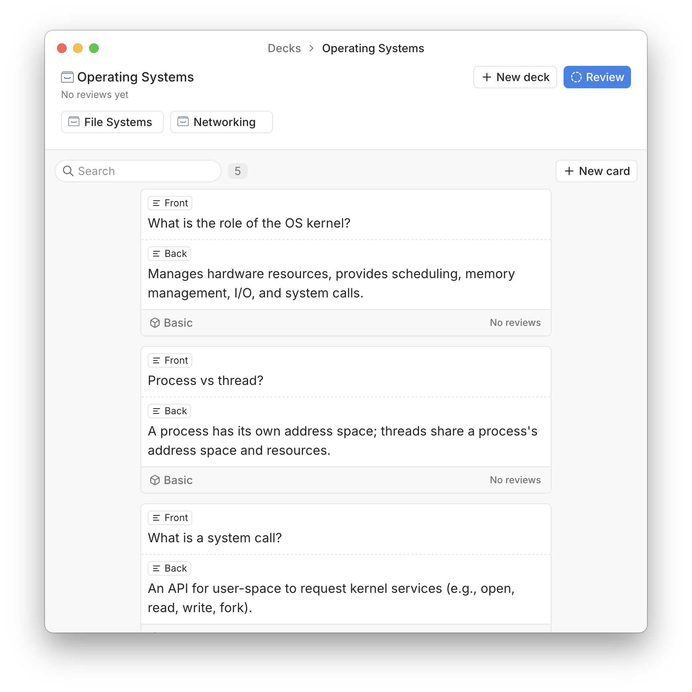

# Flashcards

Simple flashcards app. The idea is to provide a local [obsidian-like](https://obsidian.md/) experience, with everything being stored locally. There is an emphasis on the user experience being clean and functional, and the app being fast and responsive. Features of this app take inspiration from [Anki](https://apps.ankiweb.net/) and [Mochi](https://mochi.cards/).

See [note.md](./note.md) for current state of the project, and the roadmap.

## Tech stack
- TypeScript to power it all
- Tailwind of course
- React with [electron-vite](https://electron-vite.org/) as the build tool
- [Shadcn](https://ui.shadcn.com/) for components
- [Tanstack Query](https://tanstack.com/query/latest) for data fetching
- [React Router](https://reactrouter.com/) for in memory routing
- SQLite for local persistence
- [Drizzle](https://orm.drizzle.team/) for the ORM
- [Zod](https://zod.dev/) for schema validation
- [Framer Motion](https://www.framer.com/motion/) for animations
- [Tabler Icons](https://tabler.io/icons) for the icons

And no, this app wasn't vibe coded.

